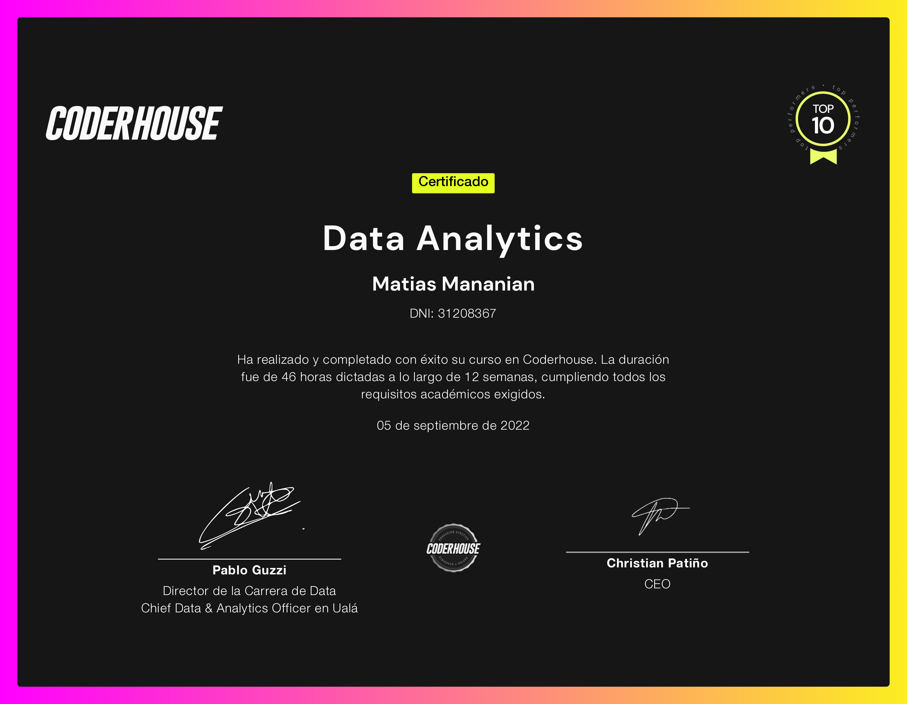

<h1>Data Analytics Tour de France</h2>

<h3>Final Project of Data Analytics Course at Coderhouse</h3>

<h4> 1. Introduction</h4>
The TDF is an annual multi-stage cycle race that takes place primarily in France. Although occasionally it passes through nearby countries.
It is one of the most watched sports competitions in the world. Broadcast in 180 countries and seen by 3.5 billion people each year.
The Tour was created in 1903 and hardly stopped during the 2 World Wars.

<h4> 2. Objective </h4>
You want to explore the history of TDF from a data perspective.
The idea is to make statements about the runners and about the race in general.

<h4> 3. Scope </h4>
To carry out the study, all the information found from 1930 to 2016 was taken into account.
On October 22, 2012, Lance Armstrong is formally stripped of the seven Tour de France titles he won between 1999 and 2005. He was banned for life from cycling after being found to have used illegal drugs.
For this work, data from those years were not taken into account.

<h4> 4. End user and application level of the analysis. </h4>
It is aimed at the general public, who may not know about the race, and at people who have a notion of it and want to know even more.

<h4> 5. Technological tools implemented. </h4> 
For the present work the following programs were used:
- Excel for reading and cleaning the datasets.
- Draw.io for the creation of the entity-relationship diagram (https://app.diagrams.net).
- Power BI Desktop for the creation of the dashboard.

<h4> 6. Entity-relationship diagram of the selected tables.</h4> 

<h4> 7. Selected segmentation.</h4>
A slicer was added to be able to filter the data by years. With it you can choose a particular year or a group of years.

<h4> 8. Transformations made.</h4>
- Table_Calendar table was created.

- Because there are results that were removed from the history, a global filter was created so that they are not taken into account.

- A ClickHereHome bookmark is created on the Home page. It is a text box that explains why the results mentioned above were removed from the history.
It is accessed by clicking on a text box.

- Filters are created per page and per element to show the wanted results.

- Tooltips are created so that more information appears if you go over the graph.

- The following measure was created in the Cities table:

Count_Cities = DISTINCTCOUNT(Cities[City])
It counts the number of cities through which the TDF passed.

- The following measures were created in the Date_Start_Finish table:

Ave_Duration = AVERAGE(Date_Start_Finish[Duration])
Average number of days that the TDF lasted in the period of time studied.

Max_Duration = MAX(Date_Start_Finish[Duration])
Maximum average of days that the TDF lasted in the period of time studied.

Min_Duration = MIN(Date_Start_Finish[Duration])
Minimum average of days that the TDF lasted in the period of time studied.

- The following measurements were created in the Race_Data table:

Max_Km = MAX(Race_Data[Total_Km])
Maximum average km traveled in an edition.

Min_Km = MIN(Race_Data[Total_Km])
Minimum average km traveled in an edition.

Sum_Entrants = SUM(Race_Data[Entrants])
Total number of runners who started the TDF in the period of time studied.

Sum_Finishers = SUM(Race_Data[Finishers])
Total number of runners who finished the TDF in the period of time studied.

Sum_Stages = SUM(Race_Data[Num_Stages])
Total number of runners who finished the TDF in the period of time studied.

Sum_Total_Km = SUM(Race_Data[Total_Km])
Total number of km traveled in the period of time studied.

- In the Winners_Data table the following measures were created:

Ave_History_Speed ​​= AVERAGE(Winners_Data[Avg_Speed])
Average speed in the period of time studied.

Count_Nationality = DISTINCTCOUNT(Winners_Data[Nationality])
Number of nationalities of TDF runners in the period of time studied.

Count_Team = DISTINCTCOUNT(Winners_Data[Team])
Number of teams in the period of time studied.

Max_Ave_Speed ​​= MAX(Winners_Data[Avg_Speed])
Maximum average speed of a winner in the period of time studied.
Min_Ave_Speed ​​= MIN(Winners_Data[Avg_Speed])
Minimum average speed of a winner in the period of time studied.

- In the Race_Data table, the columns Withdrawals and Ave_Withdrawals were created.
Withdrawals = (Entrants) – (Finishers)
Ave_Withdrawals = ([Withdrawals] * 100) / Entrants

- In the Date_Start_Finish table the Duration column was created
.
Duration = Duration.Days([EndDate]-[Start_Days])

- The table LastUpdatePB Date is created. Where the DateTime.LocalNow() function is used to retrieve the date of the last update of the file in Power Bi.

- In the Cities table, the Fx_Country function and the Country column were created.
What the function does is connect to the BING API and find out the country given the longitude and latitude. The column is the results of the function.

Fx_Country

let
    Country = (lat as text, long as text) =>
let
    Source = Xml.Tables(Web.Contents("http://dev.virtualearth.net/REST/v1/Locations/"&lat&","&long&"?
o=xml&key=yrpxQ0r9fx0EIzqNjn4m~bOwNFoUgWB2FolmEWx5w9w~AidsLHcSsfkFp-DbTBR0fyyQC0NjIw_Cqwndw5FLgb48UBfXG5ZUbVP0Q7tOzg04")),
    #"Tipo cambiado" = Table.TransformColumnTypes(Origen,{{"Copyright", type text}, {"BrandLogoUri", type text}, {"StatusCode", Int64.Type}, {"StatusDescription", type text}, {"AuthenticationResultCode", type text}, {"TraceId", type text}}),
    ResourceSets = #"Tipo cambiado"{0}[ResourceSets],
    ResourceSet = ResourceSets{0}[ResourceSet],
    #"Tipo cambiado1" = Table.TransformColumnTypes(ResourceSet,{{"EstimatedTotal", Int64.Type}}),
    Resources = #"Tipo cambiado1"{0}[Resources],
    Location = Resources{0}[Location],
    #"Tipo cambiado2" = Table.TransformColumnTypes(Location,{{"Name", type text}, {"Confidence", type text}, {"MatchCode", type text}}),
    Address = #"Tipo cambiado2"{0}[Address],
    #"Tipo cambiado3" = Table.TransformColumnTypes(Address, {"CountryRegion", type text})
in
    #"Tipo cambiado3"
in 
    Country

<h4> 9. Data visualization.</h4>
Dashboard visualization was done in Power BI.
Below is a brief summary of each of the pages created:

-	Homepage.
It gives a brief description of what the TDF is.
Buttons are added to the other sheets of the presentation.
The date of the last update of the Power BI file is added.

<h4> More information in the pdf file.</h4>

